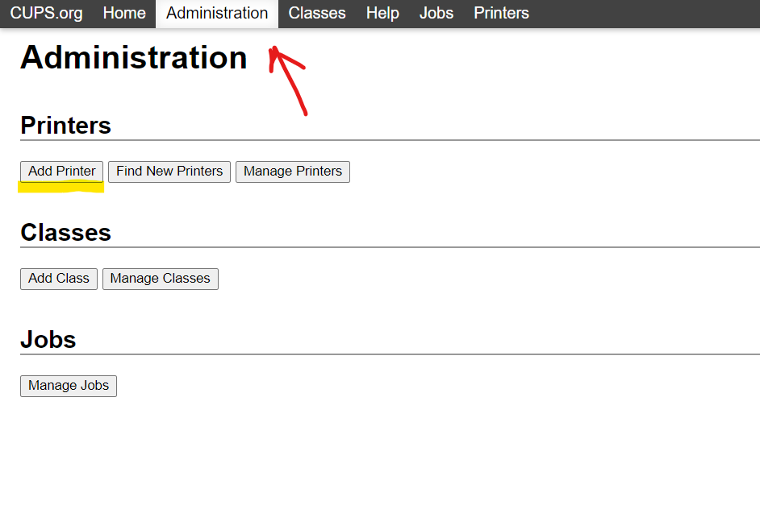
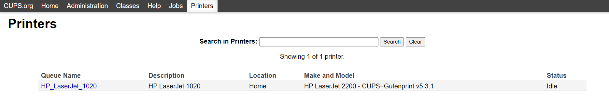
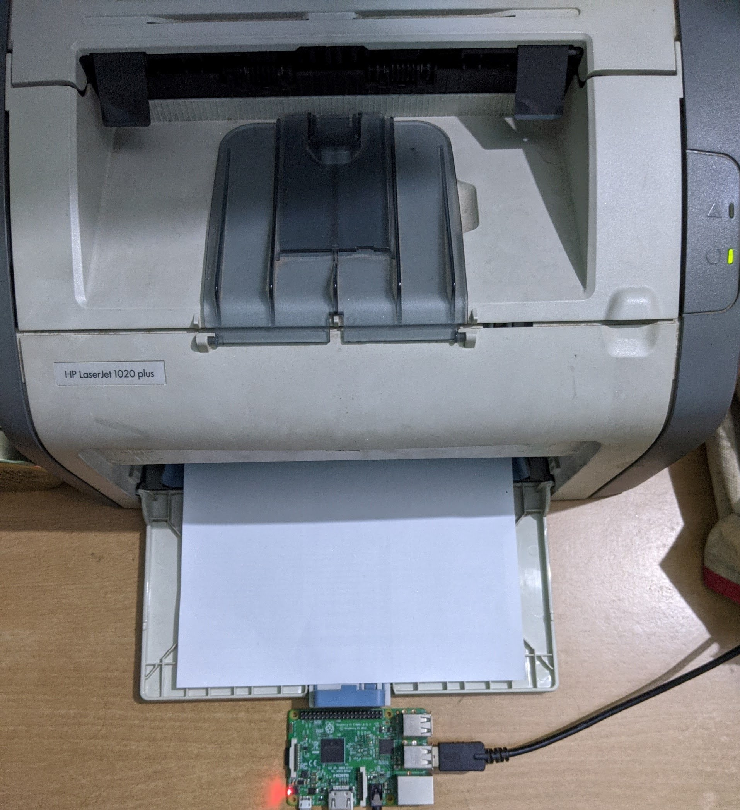

# Print Server using Raspberry Pi

I have an old printer at home which dont't have super rich feature like wi-fi connectivity. I used my old laying Raspberry Pi to develop a print server on my local network so that i can access my printer from any device on my network from any location in my home.

## Setting up Raspberry Pi (Headless)

I installed Raspbian OS on my Pi, and booted my Pi through SSH. Connected my Pi to the wifi router and used Network Mapper on windows to get the IP address of the Pi. Used Ip address to ping the pi and SSH to boot it up. 

## Print Server using CUPS
CUPS (Common Unix Printing System) is a printing system for UNIX like operating systems based computers. It gives computers on which it is running the ability to act as a print server. A computer running CUPS is able to accept jobs from client devices, process them and pass it on to the appropriate printer to print.

## Setting the Print Server on Pi
Installed CUPS on the pi and configred it to for my project, like changing port on which it should communicate and changing permissions for accessing server and admin pages. Changed the network accesibility of the CUPS to connect and make it accesibilie to the local network. These steps helps in hosting the CUPS on the Raspberru pi IP address's port 631. 

 

As CUPS is a Unix based system we have to make sure we can communicate it through our windows or linux based system across network. For this I insatlled Samba which is an interoperability tool that allows the windows based system to communicate with CUPS running on the Raspberry Pi to print. Configured print section in the samba configuration file for allowing guest in the network.

 

## Adding Printer to the server
After all above steps, added my HP printer to the server by going to the CUPS server. After setting up printer on server byu selecting appropriate model, we add a printer device on our windows system by searching it over the network. Once added, set-up is ready and you have your own wireless printer. 

 

# The final set-up

 